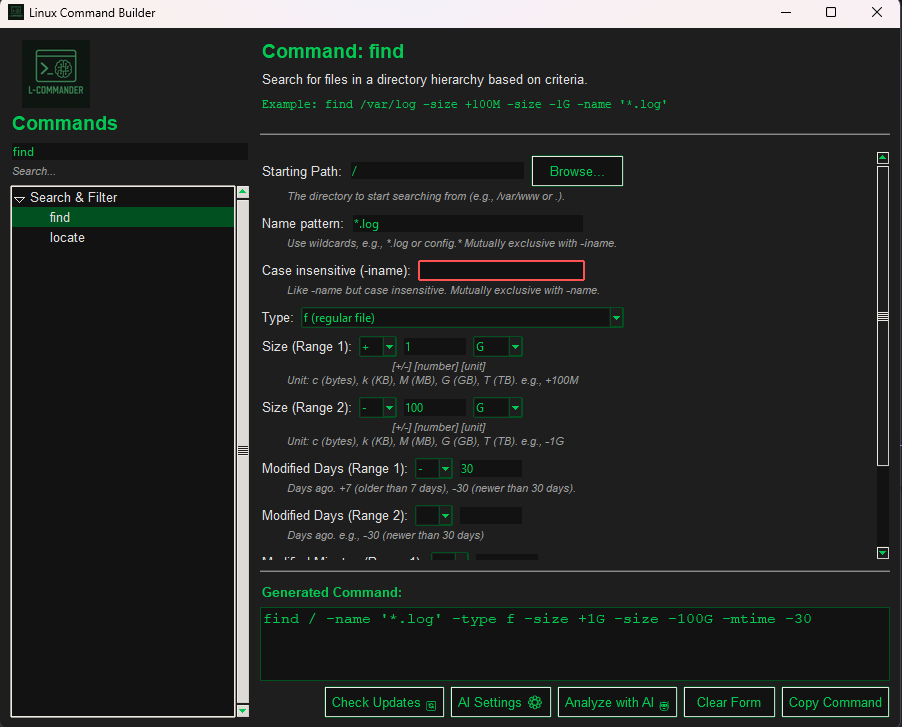

<p align="center">        /t/t<h1>🐧 Linux Command Builder</h1></p>

<div align="center">

<p align="center">
  
</p>



**A beautiful, cross-platform GUI application for building complex Linux shell commands with ease**

[](https://www.python.org/downloads/)
[](LICENSE)
[](https://github.com/yourusername/linux-commander)

[Features](#-features) • [Installation](#-installation) • [Usage](#-usage) • [Commands](#-supported-commands) • [Development](#-development)

</div>

---

## 📖 Overview

Linux Command Builder is a modern, intuitive desktop application that helps users construct complex Linux shell commands through a user-friendly graphical interface. Perfect for system administrators, DevOps engineers, students, and anyone who works with Linux systems.

### Why Linux Command Builder?

- 🎯 **No More Syntax Errors** - Build commands visually with validation
- 🔒 **Security First** - Built-in shell injection prevention
- 🎨 **Beautiful Dark Theme** - Easy on the eyes during long sessions
- 🚀 **Fast & Responsive** - Optimized performance with smart caching
- 🤖 **AI-Powered** - Optional AI command analysis (Claude integration)
- 🌍 **Cross-Platform** - Runs on Windows, Linux, and macOS

---

## ✨ Features

### Core Functionality

- **📝 Dynamic Form Generation** - Context-aware input fields based on command type
- **🔍 Real-Time Validation** - Instant feedback on invalid inputs
- **📋 One-Click Copy** - Copy generated commands to clipboard
- **🔎 Smart Search** - Filter commands with fuzzy search
- **💾 Command History** - Quick access to recently used commands
- **🎨 Dark Theme UI** - Professional, customizable interface

### Advanced Features

- **🤖 AI Command Analysis** - Explain what your command does (requires API key)
- **🔄 Auto-Updates** - Built-in command definition updater
- **⚙️ Customizable** - Adjust settings to your preferences
- **📊 Command Preview** - See the final command before copying
- **🛡️ Security** - Automatic escaping and sanitization

### Supported Input Types

| Type | Description | Example |
|------|-------------|---------|
| Text Input | Standard text fields | File names, paths |
| Dropdowns | Predefined options | File types, permissions |
| Checkboxes | Boolean flags | `-l`, `-a`, `-r` |
| Date Pickers | Date selection | Modified dates |
| File Pickers | Browse filesystem | Input/output files |
| Permission Grids | chmod permissions | 755, 644 |
| Size Inputs | File size filters | +100M, -5k |

---

## 🚀 Installation

### Prerequisites

- **Python 3.8 or higher**
- **pip** package manager

### Option 1: Run from Source (Recommended for Development)
```bash
# Clone the repository
git clone https://github.com/crenta/Linux-Commander.git
cd Linux-Commander

# Install dependencies
pip install -r requirements.txt

# Run the application
python main.py
```

### Option 2: Standalone Executable

> ⚠️ **COMING SOON...**
> Yet to be implemented.

Download the latest release for your platform:
- 🪟 [Windows (.exe)](https://github.com/yourusername/linux-commander/releases)
- 🐧 [Linux (AppImage)](https://github.com/yourusername/linux-commander/releases)
- 🍎 [macOS (.dmg)](https://github.com/yourusername/linux-commander/releases)

### Requirements
```text
Python>=3.8
tkinter (included with Python)
Pillow>=9.0.0
pyperclip>=1.8.2
validators>=0.20.0
```

---

## 🎮 Usage

### Basic Workflow

1. **Select a Command** from the left sidebar
2. **Fill in Parameters** using the dynamic form
3. **Preview** the generated command at the bottom
4. **Copy** the command to your clipboard
5. **Run** on your Linux system

### Example: Building a `find` Command
```bash
# Generated command:
find /var/log -name '*.log' -type f -mtime -7 -size +10M
```

**Steps:**
1. Select `find` from "Search and Filter" category
2. Enter search path: `/var/log`
3. Set name pattern: `*.log`
4. Select type: `file`
5. Set modified time: `-7` (last 7 days)
6. Set size: `+10M` (larger than 10MB)

### Keyboard Shortcuts

> ⚠️ **COMING SOON...**
> Yet to be implemented.

| Shortcut | Action |
|----------|--------|
| `Ctrl+C` | Copy command |
| `Ctrl+L` | Clear form |
| `Ctrl+F` | Focus search |
| `Escape` | Clear search |

---

## 📚 Supported Commands

### File & Directory Management
- `find` - Search for files and directories
- `ls` - List directory contents
- `cp` - Copy files and directories
- `mv` - Move/rename files
- `rm` - Remove files and directories
- `mkdir` - Create directories
- `touch` - Create empty files

### File Content
- `cat` - Display file contents
- `grep` - Search text patterns
- `sed` - Stream editor
- `awk` - Text processing
- `head` - Display file beginning
- `tail` - Display file end
- `wc` - Word/line/byte count

### Archiving & Compression
- `tar` - Archive files
- `gzip` - Compress files
- `zip` - Create ZIP archives
- `unzip` - Extract ZIP archives

### System Information
- `df` - Disk space usage
- `du` - Directory size
- `free` - Memory usage
- `top` - Process viewer
- `ps` - Process status
- `uname` - System information

### Permissions
- `chmod` - Change file permissions
- `chown` - Change file owner
- `chgrp` - Change file group

### Networking
- `ping` - Test connectivity
- `curl` - Transfer data
- `wget` - Download files
- `netstat` - Network statistics
- `ssh` - Remote login

### Process Management
- `kill` - Terminate processes
- `killall` - Kill by name
- `pkill` - Kill by pattern

### Package Management
- `apt` - Debian/Ubuntu packages
- `yum` - Red Hat/CentOS packages
- `dnf` - Fedora packages

*...and many more!*

---

## 🤖 AI Features

> ⚠️ **Compatibility Note:**
> This feature is currently only tested on **Mistral** & **Gemini**. You may have to edit the specific model string in `settings.json`.

### Setup

1. Click **"AI Settings ⚙️"** button
2. Enter your **API KEY**
3. Click **"Save Settings"**

### Using AI Analysis

1. Build a command
2. Click **"Analyze with AI 🤖"**
3. Get detailed explanation including:
   - Check the syntax
   - What the command does
   - Potential risks/warnings
   - Alternative approaches
   - Usage examples

### Example AI Output
```
🤖 Command Analysis

Command: find /var/log -name "*.log" -type f -mtime -7 -delete

📋 Explanation:
This command searches for all log files in /var/log modified 
in the last 7 days and deletes them.

⚠️ Warnings:
- DESTRUCTIVE: Files will be permanently deleted
- Consider backing up first
- Test with -print before using -delete

💡 Safer Alternative:
find /var/log -name "*.log" -type f -mtime -7 -print
```

---

## ⚙️ Configuration

### Application Settings

Settings are stored in:
- **Windows:** `%LOCALAPPDATA%\LinuxCommander\`
- **Linux:** `~/.local/share/LinuxCommander/`
- **macOS:** `~/Library/Application Support/LinuxCommander/`

### Command Definitions

Command definitions are JSON files in the `commands/` directory. You can:
- ✏️ Edit existing commands
- ➕ Add new commands
- 🔄 Update via built-in updater

### Debug Mode

Enable verbose logging:
```bash
# Windows
set DEBUG=1
python main.py

# Linux/macOS
DEBUG=1 python main.py
```

Logs are saved to `app.log` in the data directory.

---

## 🛠️ Development

### Project Structure
```
linux-commander/
├── main.py                    # Application entry point
├── ui_controller.py           # Main UI coordination
├── theme_manager.py           # Visual theming
├── command_manager.py         # Command loading & parsing
├── form_builder.py            # Dynamic form generation
├── command_generator.py       # Shell command assembly
├── logger_config.py           # Logging configuration
├── constants.py               # Application constants
├── ai_analyzer.py             # AI integration (optional)
├── settings_panel.py          # Settings UI (optional)
├── update_manager.py          # Update system (optional)
├── settings_manager.py        # Manages the AI setttings
├── commands/                  # Command definitions (JSON)
│   ├── file_operations.json
│   ├── system_info.json
│   └── ...
├── settings.json              # ** API KEYS & model info **
├── LOGO.png                   # Application icon
├── requirements.txt           # Python dependencies
├── README.md                  # This file
└──  LICENSE                    # License
```

### Adding New Commands

Create a JSON file in `commands/`:
```json
{
  "Category Name": {
    "command_name": {
      "description": "What this command does",
      "example": "command_name -flag value",
      "requires_sudo": false,
      "sudo_optional": true,
      "fields": [
        {
          "type": "text",
          "label": "Input File",
          "flag": "-f",
          "tooltip": "Path to input file"
        },
        {
          "type": "checkbox",
          "label": "Verbose Output",
          "flag": "-v"
        }
      ]
    }
  }
}
```

### Field Types Reference
```json
{
  "type": "text",           // Standard text input
  "type": "checkbox",       // Boolean flag
  "type": "dropdown",       // Selection from options
  "type": "file_picker",    // Browse for file
  "type": "dir_picker",     // Browse for directory
  "type": "date_input",     // Date selector
  "type": "size_input",     // File size with units
  "type": "permission_grid", // chmod permission grid
  "type": "number_input",   // Numeric input only
  "type": "url"             // URL with validation
}
```

### Running Tests
```bash

# Run specific test file
python tester1.py
python tester2.py
python tester3.py
```

### Building Executable

> ⚠️ **Untested:**
> I haven't built and tested the EXE yet

```bash
# Install PyInstaller
pip install pyinstaller

# Build for current platform
pyinstaller LinuxCommander.spec

# Output in dist/ folder
```

---

## 🔒 Security

### Built-in Protections

- ✅ **Shell Injection Prevention** - All inputs sanitized with `shlex.quote()`
- ✅ **Path Validation** - Invalid filesystem characters blocked
- ✅ **Input Length Limits** - DoS prevention (8000 char max)
- ✅ **URL Validation** - Malformed URLs rejected
- ✅ **JSON Schema Validation** - Command definitions validated on load

### Best Practices

- 🔍 **Review commands** before running them on production systems
- 🧪 **Test in safe environment** first
- 💾 **Backup important data** before destructive operations
- 🔐 **Use sudo carefully** - only when necessary
- 📝 **Read command descriptions** and tooltips

---

## 🤝 Contributing

Contributions are welcome! Here's how you can help:

### Reporting Bugs

1. Check [existing issues](https://github.com/Crenta/Linux-Commander/issues)
2. Create a new issue with:
   - Clear description
   - Steps to reproduce
   - Expected vs actual behavior
   - Screenshots (if applicable)
   - Log file (`app.log`)

### Suggesting Features

Open an issue with:
- Feature description
- Use case / motivation
- Proposed implementation (optional)

### Submitting Code

1. Fork the repository
2. Create a feature branch (`git checkout -b feature/amazing-feature`)
3. Make your changes
4. Add tests if applicable
5. Commit with clear messages (`git commit -m 'Add amazing feature'`)
6. Push to your fork (`git push origin feature/amazing-feature`)
7. Open a Pull Request

### Code Style

- Follow PEP 8 guidelines
- Use descriptive variable names
- Add docstrings to functions
- Keep functions focused and small
- Add comments for complex logic

---

## 📝 License

This project is licensed under the MIT License - see the [LICENSE](LICENSE) file for details.
```
MIT License

Copyright (c) 2025 Crenta

Permission is hereby granted, free of charge, to any person obtaining a copy
of this software and associated documentation files (the "Software"), to deal
in the Software without restriction, including without limitation the rights
to use, copy, modify, merge, publish, distribute, sublicense, and/or sell
copies of the Software, and to permit persons to whom the Software is
furnished to do so, subject to the following conditions:

The above copyright notice and this permission notice shall be included in all
copies or substantial portions of the Software.

THE SOFTWARE IS PROVIDED "AS IS", WITHOUT WARRANTY OF ANY KIND, EXPRESS OR
IMPLIED, INCLUDING BUT NOT LIMITED TO THE WARRANTIES OF MERCHANTABILITY,
FITNESS FOR A PARTICULAR PURPOSE AND NONINFRINGEMENT. IN NO EVENT SHALL THE
AUTHORS OR COPYRIGHT HOLDERS BE LIABLE FOR ANY CLAIM, DAMAGES OR OTHER
LIABILITY, WHETHER IN AN ACTION OF CONTRACT, TORT OR OTHERWISE, ARISING FROM,
OUT OF OR IN CONNECTION WITH THE SOFTWARE OR THE USE OR OTHER DEALINGS IN THE
SOFTWARE.
```

---

## 🙏 Acknowledgments

- **Python Community** - For the amazing ecosystem
- **Tkinter** - For the cross-platform GUI framework
- **Contributors** - Thank you for your contributions!

### Built With

- [Python](https://www.python.org/) - Programming language
- [Tkinter](https://docs.python.org/3/library/tkinter.html) - GUI framework
- [Pillow](https://python-pillow.org/) - Image processing

---

## 📞 Support

### Need Help?

- 💬 [Open an issue](https://github.com/crenta/Linux-Commander/issues)

### Found a Bug?

Please report it on our [issue tracker](https://github.com/crenta/Linux-Commander/issues) with:
- Description of the problem
- Steps to reproduce
- Expected behavior
- Actual behavior
- Log file contents

---

## 🗺️ Roadmap

### Version 2.0 (Planned)

- [ ] Command history with search
- [ ] Favorite commands
- [ ] Command templates/snippets
- [ ] Export command collections
- [ ] Multi-language support
- [ ] Light theme option
- [ ] Plugin system
- [ ] Command scheduling
- [ ] SSH integration (run commands remotely)

### Version 1.5 (In Progress)

- [x] AI command analysis
- [x] Auto-update system
- [x] Improved error handling
- [ ] Command chaining (pipes)
- [ ] Batch operations

---

<div align="center">

**Made with ❤️ by [Crenta](https://github.com/crenta)**

⭐ Star us on GitHub — it helps!


</div>


