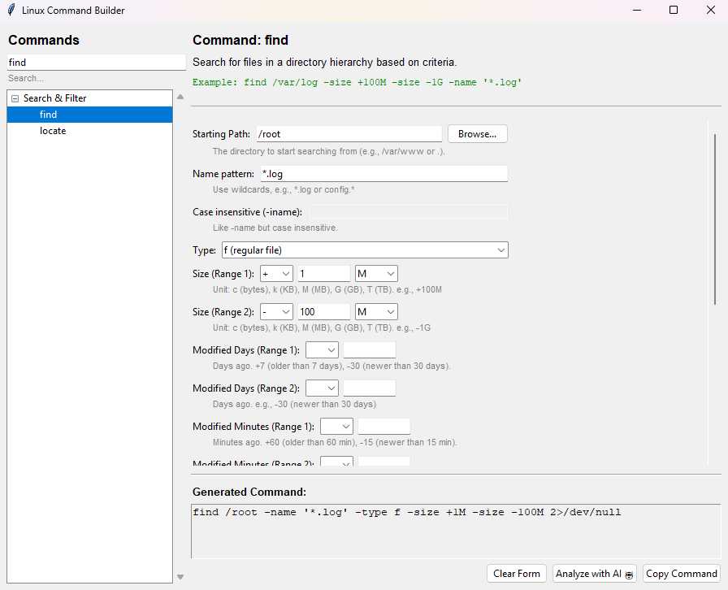

# L-Commander (`./lcom`)

L-Commander is a desktop GUI application built with Python and Tkinter designed to help users build, understand, and execute complex Linux commands. It provides a searchable, form-based interface for constructing commands and uses the Mistral AI API to analyze, explain, and validate them before execution.

## 📸 Screenshot



## ✨ Key Features

- **Dynamic Command Builder**: Select a command (e.g., `tar`, `chmod`, `find`) and a form dynamically generates with all relevant options, flags, and arguments.
- **Smart Input Widgets**:
  - 📁 **Native File Browsers**: Integrated "Browse..." buttons for selecting files and directories directly from your OS.
  - 📅 **Calendar-Aware Dates**: Date pickers that automatically adjust days based on the selected month and year.
  - 🔢 **Validated Inputs**: Numeric fields that prevent invalid character entry.
  - 🎛️ **Rich UI Elements**: Checkboxes, dropdowns, and permission grids (for `chmod`-style masks).
- **AI-Powered Analysis** 🤖: Integrates with Mistral AI to provide a second opinion on your command:
  - **Syntax Validation**: Checks if the command is structured correctly.
  - **Explanation**: Clear, natural language summary of what the command will do.
  - **Safety Checks**: Highlights potentially dangerous flags or common pitfalls.
  - **Documentation**: Provides direct links to relevant `man` pages.
- **Searchable Database**: Instantly filter through hundreds of available commands.
- **Clipboard Ready**: Copy the finalized command to your clipboard with one click for immediate terminal use.
- **Sudo Intelligence**: Automatically handles `sudo` prefixing for commands that require elevated privileges.
- **Modular & Data-Driven**:
  - Commands are defined in simple JSON files, making it easy to add new ones without changing code.
  - Built on a refactored, dispatch-based widget architecture for easy extensibility.

## 🛠️ Installation

1. **Clone the repository**:
```bash
   git clone https://github.com/yourusername/l-commander.git
   cd l-commander
```

2. **Install dependencies**:
```bash
   pip install pyperclip
```
   
   > **Note**: On some Linux distributions, you may need to install Tkinter separately:
   > ```bash
   > sudo apt-get install python3-tk
   > ```

3. **Run the application**:
```bash
   python3 command_builder.py
```

## ⚙️ Configuration

To use the AI Analysis features, you must have a Mistral AI API key.

1. Obtain an API key from [Mistral AI console](https://console.mistral.ai/).
2. Open the `config.py` file in the root directory and add your API key:
```python
   MISTRAL_API_KEY = "your_api_key_here"
```

## 🧩 Adding New Commands

L-Commander is designed to be easily extensible. Commands are stored in the `commands/` directory as JSON files.

**Example JSON structure** (`commands/file_ops.json`):
```json
{
  "File Operations": {
    "tar": {
      "description": "Archiving utility",
      "example": "tar -czvf archive.tar.gz /path/to/folder",
      "fields": [
        {
          "type": "checkbox",
          "label": "Create archive",
          "flag": "-c",
          "disables": ["-x"]
        },
        {
          "type": "file_save_as",
          "label": "Output Filename",
          "flag": "-f"
        },
        {
          "type": "dir_picker",
          "label": "Target Directory",
          "flag": ""
        }
      ]
    }
  }
}
```
